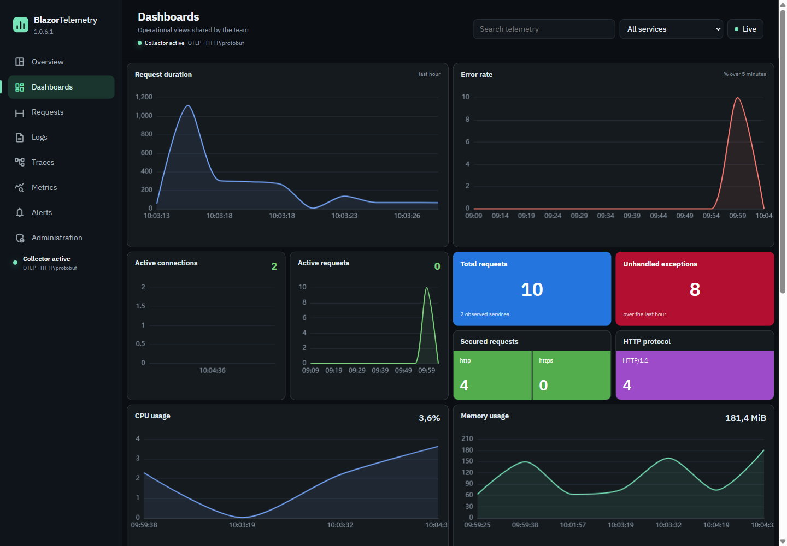
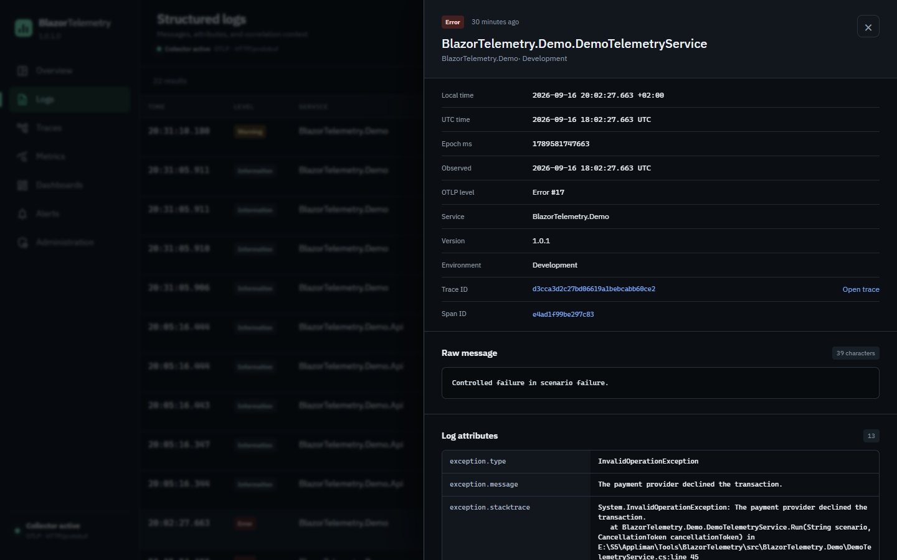
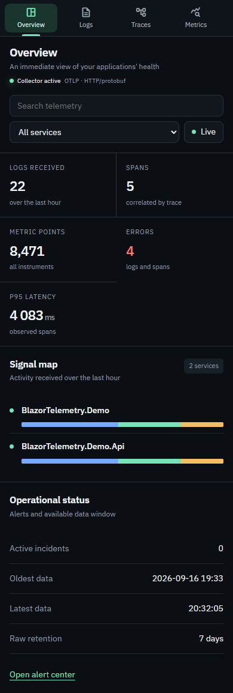
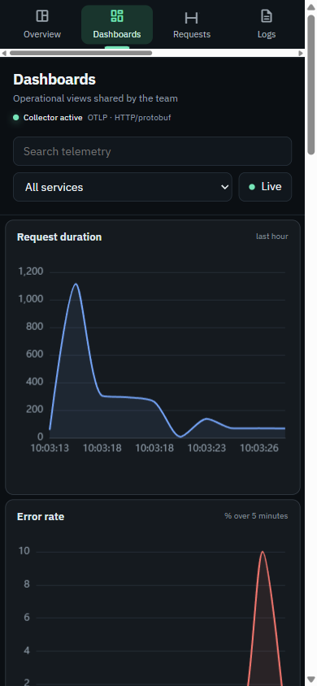
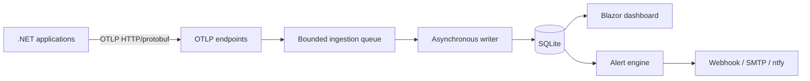

<div align="center">

# BlazorTelemetry

### Essential .NET observability in a self-hosted Blazor interface.

Collect, correlate, and explore your OpenTelemetry **logs**, **traces**, and **metrics** over OTLP gRPC or HTTP/protobuf without operating a full distributed observability stack.

[](https://dotnet.microsoft.com/)
[](https://dotnet.microsoft.com/apps/aspnet/web-apps/blazor)
[](https://opentelemetry.io/)
[](https://sqlite.org/)
[](https://www.docker.com/)

</div>



## Why BlazorTelemetry ?

BlazorTelemetry is designed for small .NET teams that need to understand their applications quickly while keeping the infrastructure simple to operate.

- **One service to deploy** — OTLP collector, storage, user interface, and alerting.
- **Three signals in one place** — structured logs, distributed traces, and metrics.
- **Immediate correlation** — move from a log to its trace through `TraceId` and `SpanId`.
- **Durable local storage** — SQLite with configurable retention and a database size budget.
- **Two operating modes** — a standalone Docker application or an embedded Blazor Server dashboard.
- **Built for investigation** — full-text search, service filters, live refresh, shared dashboards, and persistent incidents.

> BlazorTelemetry favors the simplicity of a single instance. It is not intended to replace a distributed platform such as Grafana, Prometheus, Loki, or Tempo for very high volumes or high-availability deployments.

## Product tour

### Investigate without switching tools

The detail drawer exposes the OTLP level, service, environment, timestamps, attributes, and correlation identifiers. Selecting the `TraceId` opens the related trace directly.



### Responsive by design

The overview and operational dashboards remain usable on mobile, with compact navigation and filters adapted to the available width.

<table>
  <tr>
    <td width="50%" align="center"><strong>Overview</strong></td>
    <td width="50%" align="center"><strong>Operational dashboard</strong></td>
  </tr>
  <tr>
    <td align="center"></td>
    <td align="center"></td>
  </tr>
</table>

## Features

| Area | Capabilities |
| --- | --- |
| Collection | OTLP HTTP/protobuf on `/v1/logs`, `/v1/traces`, and `/v1/metrics` |
| Exploration | Global search, service filters, time windows, and live refresh |
| Correlation | Navigation across logs, traces, and spans using `TraceId` and `SpanId` |
| Dashboards | Request duration, error rate, activity, protocols, and endpoint insights |
| Alerts | Alert rules, persistent incidents, and state tracking |
| Notifications | Webhook, SMTP, and [ntfy](https://ntfy.sh/) |
| Security | Optional ingestion keys and passwordless TOTP authentication |
| Storage | SQLite, automatic cleanup, separate retention policies, and a size budget |
| Deployment | Local Docker, staging, and production behind Traefik |

## Architecture



OTLP reception is decoupled from database writes through a bounded queue. Background services then manage persistence, retention, alert evaluation, and notification delivery.

## Quick start with Docker

### Prerequisites

- Docker Desktop or Docker Engine with Docker Compose.
- Two private values: the administrator email and a shared TOTP secret.

From the `src` directory, create a local `.env` file. It is ignored by Git:

```dotenv
BLAZOR_TELEMETRY_ADMIN_EMAIL=admin@example.com
BLAZOR2FA_SECRET_KEY=replace-with-a-long-random-secret
```

Start the container:

```bash
cd src
docker compose up --build -d
```

Open [http://localhost:8080/login/qr-code](http://localhost:8080/login/qr-code), enter the configured `BLAZOR2FA_SECRET_KEY`, and scan the generated QR code with your authenticator app. You can then sign in at [http://localhost:8080/login](http://localhost:8080/login) with the administrator email and the current six-digit code.

The telemetry database and ASP.NET Core Data Protection keys are persisted in the `blazor-telemetry-dev-data` Docker volume. No password or local user database is used.

## Connect a .NET application

Configure your OpenTelemetry exporter to use OTLP gRPC, which is enabled by default on port `4317`:

```dotenv
OTEL_SERVICE_NAME=my-service
OTEL_EXPORTER_OTLP_ENDPOINT=http://localhost:4317
OTEL_EXPORTER_OTLP_PROTOCOL=grpc
```

Example ASP.NET Core configuration:

```csharp
using OpenTelemetry.Logs;
using OpenTelemetry.Metrics;
using OpenTelemetry.Resources;
using OpenTelemetry.Trace;

var builder = WebApplication.CreateBuilder(args);

builder.Services.AddOpenTelemetry()
    .ConfigureResource(resource => resource.AddService("my-service"))
    .WithTracing(tracing => tracing
        .AddAspNetCoreInstrumentation()
        .AddHttpClientInstrumentation()
        .AddOtlpExporter())
    .WithMetrics(metrics => metrics
        .AddRuntimeInstrumentation()
        .AddAspNetCoreInstrumentation()
        .AddOtlpExporter());

builder.Logging.AddOpenTelemetry(logging =>
{
    logging.IncludeFormattedMessage = true;
    logging.IncludeScopes = true;
    logging.AddOtlpExporter();
});
```

OTLP HTTP/protobuf remains available on the web endpoint through `/v1/logs`, `/v1/traces`, and `/v1/metrics`.

Ingestion key validation is disabled by default, so no authentication header is required. In this mode, restrict access to the OTLP endpoints at the network or reverse-proxy layer, for example with an IP allowlist.

To require a key, set `BlazorTelemetry__RequireIngestionKey=true` (`BLAZOR_TELEMETRY_REQUIRE_INGESTION_KEY=true` with the provided Docker Compose files), create a key from the administration interface, and send it through `OTEL_EXPORTER_OTLP_HEADERS=X-BlazorTelemetry-Key=replace-with-the-generated-key`. Configured keys are compared in constant time. Keys created from the administration interface are stored as SHA-256 hashes and are displayed only once.

## Embed the dashboard in a Blazor application

BlazorTelemetry can also be integrated directly into a Blazor Server or interactive SSR application:

```csharp
using BlazorTelemetry.AspNetCore;

builder.Services
    .AddRazorComponents()
    .AddInteractiveServerComponents();

builder.Services.AddBlazorTelemetry(builder.Configuration);

// ...

app.UseBlazorTelemetry();
app.MapBlazorTelemetry();
app.MapRazorComponents<App>()
    .AddInteractiveServerRenderMode()
    .AddAdditionalAssemblies(typeof(BlazorTelemetry.TelemetryDashboard).Assembly);
```

Then render the dashboard from a Razor page:

```razor
@page "/telemetry"
@rendermode InteractiveServer

<TelemetryDashboard />
```

The host application must provide the `BlazorTelemetryReader` and `BlazorTelemetryAdministrator` authorization policies.

## Configuration reference

The `BlazorTelemetry` section can be configured in `appsettings.json` or through environment variables using `__` as the section separator.

| Key | Default | Description |
| --- | ---: | --- |
| `ConnectionString` | `Data Source=Data/telemetry.db` | Telemetry SQLite database |
| `RawRetentionDays` | `7` | Retention for raw logs and traces |
| `MetricRetentionDays` | `30` | Retention for metric points |
| `MaximumDatabaseBytes` | `10737418240` | Maximum database budget: 10 GiB |
| `MaximumRequestBytes` | `8388608` | Maximum OTLP request size: 8 MiB |
| `RequireIngestionKey` | `false` | Reject ingestion requests without a valid key when enabled |
| `IngestionKeys` | `{}` | `application → key` dictionary |

Environment variable example:

```bash
BlazorTelemetry__RawRetentionDays=14
```

## Deploy behind Traefik

Two Compose files are provided for a VPS running Traefik:

- `src/docker-compose.staging.yml` defaults to `ghcr.io/appliman/blazor-telemetry:staging`.
- `src/docker-compose.prod.yml` defaults to `ghcr.io/appliman/blazor-telemetry:latest`.

The external Docker network `traefik-public` must already exist. Supply the domain without a protocol or path:

```bash
cd src
DOMAIN=telemetry.example.com \
BLAZOR_TELEMETRY_ADMIN_EMAIL=admin@example.com \
BLAZOR2FA_SECRET_KEY='replace-with-a-long-random-secret' \
docker compose -f docker-compose.prod.yml up -d
```

Traefik handles HTTP-to-HTTPS redirection, TLS certificates, and routing to the internal port `8080`. The `/health/live` endpoint is used for health checks.

## Development

```bash
dotnet restore BlazorTelemetry.slnx
dotnet test BlazorTelemetry.slnx --configuration Release
dotnet run --project src/BlazorTelemetry.Host/BlazorTelemetry.Host.csproj
```

The solution is split into focused projects:

| Project | Responsibility |
| --- | --- |
| `BlazorTelemetry.Core` | Domain model, options, and storage contracts |
| `BlazorTelemetry.Sqlite` | EF Core context, migrations, and SQLite repository |
| `BlazorTelemetry.AspNetCore` | OTLP endpoints and background services |
| `BlazorTelemetry` | Razor components and dashboard interface |
| `BlazorTelemetry.Host` | Standalone application secured by passwordless TOTP authentication |
| `BlazorTelemetry.Demo` | Embedded dashboard demonstration |
| `BlazorTelemetry.Demo.Api` | Instrumented API producing logs, traces, and metrics |
| `BlazorTelemetry.Tests` | OTLP parser and persistence tests |

## Current scope

BlazorTelemetry targets a single instance serving approximately **1 to 10 applications** and an initial target flow of about **100 telemetry items per second**. These values describe the initial product scope; they are not a contractual benchmark.

For high availability, distributed storage, PromQL/LogQL querying, or very high throughput, use a dedicated distributed observability platform.
